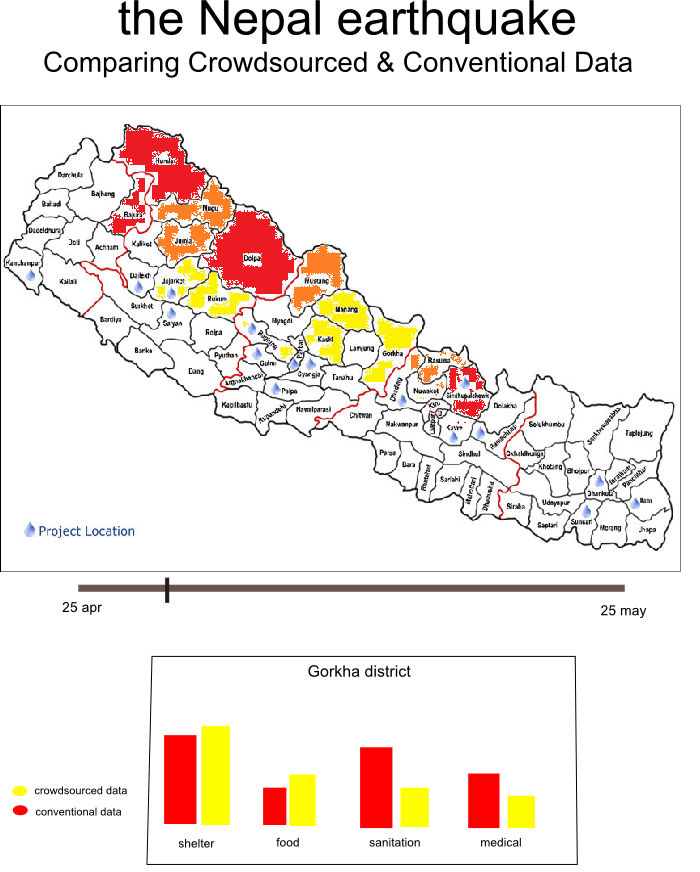

# Comparing Crowdsourced and Conventional Data in the Emergency Response
### A Case Study of the 2015 Nepal Earthquake
#### Kim de Bie, Project Proposal, 4 January 2016

_**Short overview**_

*I am planning to build a data visualization which allows the user to compare conventional and crowdsourced data in the context of the aftermath of the 2015 Nepal earthquake. The user will be able to explore to what extent crowdsourced data is useful in the disaster response, and where it can complement or even replace conventional data. [I will be writing my bachelor's thesis on this topic; this visualization builds on data that I will analyse in my thesis, but this project is separate and the visualization will not be a (graded) part of my thesis.]*

_**Problem description**_

Natural disasters do not only place enormous strain on affected individuals, but also provide a very large challenge to those who aim to provide help. In the first days after an emergency hits, it is incredibly difficult for aid workers to identify what help is needed where. Aid organizations like the United Nations compile so-called situational reports in which they document all they know about the current situation. Here, organizations mainly rely on their own colleagues on the ground and are reluctant to trust information from outsiders. Thus, those using the data are also in charge of deciding what data is collected where and when, and usually directly employ others to collect this data. However, crowdsourced data from sources such as Twitter is increasingly seen as an alternative data form which can improve post-disaster situational awareness. Contrary to conventional data as collected by aid organizations, crowdsourced data is collected in a bottom-up manner. It is not the aid organization which determines what kind of data will be produced, but “the crowd” decides which information becomes available. 

Aid organizations generally are very hesitant to include crowdsourced data in their disaster response: they are skeptical of the quality, trustworthiness and relevance of the data, and often lack the technological expertise to extract the data from the web. Generally, there is an organizational misfit between crowdsourced data and aid organizations. However, research shows that this skepticism on the part of aid organizations is not always justified and that crowdsourced data is generally reliable and relevant. The question that remains unanswered is the extent to which crowdsourced data provides answers that conventional data cannot give. Crowdsourced data can be useful if it provides information faster or in more detail than conventional data, or when it provides information that is simply not made available through conventional data collection processes. In my data visualization, I aim to provide insights into the differences between crowdsourced and conventional data. The goal is to increase understanding of where crowdsourced data may indeed be a useful addition to conventional data collection processes, and in what aspects sticking with conventional data is the best alternative. 

_**Features of the visualization**_

The visualization will build on both conventional and crowdsourced data collected after the earthquake that occurred on 25 April 2015 in Nepal. I aim to display the data on the map of Nepal. The primary aim of my visualization is to express data *quantity*, in other words, to say something about the data density that both data sources provide. Data points will be linked to a district on the map. It should be visible what amount of data is available for different each district
for both crowdsourced and conventional data. When more data is available for a district (i.e. data density is higher), this should be made visible: the district should for example become darker. (It should be possible to display only conventional or only crowdsourced data, for example by ticking a checkbox.) When clicking on a district, I want a bar chart to pop up which displays e.g. in what categories data is available for both datasets; the bar chart should give some information about the qualitative aspects of the data. Moreover, the visualization should contain a time slider, so that different days of the disaster response become available (I expect that crowdsourced data will be available faster than conventional data, which will be made insightful by this element).

In addition, especially in the conventional dataset, there are many points that cannot necessarily be linked to a point on the map. The dataset contains many statements like ‘more medical supplies are needed’ or ‘8,500 classrooms have been destroyed’ that link to all affected locations and not to one location on the map specifically. I am not really sure about how I should handle these data points. At this point, I see two possibilities: 1) add them as a data point in every single district that they apply to (i.e. to all districts that are currently marked as affected); 2) add an additional bar chart (below the map) to display the ‘general’ information that becomes available. 

_**Data sources**_

I need two datasets for this visualization, namely one containing conventional and one for crowdsourced data. As mentioned above, conventional data is written up in situational reports, in a text format. I hand-coded the situational reports that were produced by the United Nations after the Nepal earthquake. Thus, I currently have a dataset (in csv-format) that contains 827 rows, where each row represents either a general observation about the situation (e.g. 500 houses collapsed in a certain village; 7600 deaths counted up to now) or an identified need (e.g. the Kathmandu hospital needs antibiotics; more debris removal equipment is required). In addition, various variables (such as location, time/date, source, category) are collected. As it stands, it seems that the format and variables that I currently have are sufficient.  

Crowdsourced data comes in various forms. The most obvious examples are Tweets and Facebook posts that are directly scraped from the web. However, for the Nepal earthquake I encountered issues of accessibility and comparability. Many tweets from April are already removed from the web; even if they are available, it is very hard to select the right keywords so that all and only relevant tweets will show up, and of course there are language issues. However, Humanity Road (www.humanityroad.org) produced situational reports, based on crowdsourced data. Thus, they processed crowdsourced data in a rather conventional form, and as such these crowdsourced situational reports seem most comparable to the conventional situational reports produced by the UN. I am currently in the process of coding these reports in the same way I did for the UN-situational reports. 

_**Technical implementation**_

I will build this data visualization using D3.js. http://bost.ocks.org/mike/map/ provides a thorough explanation of how to implement maps within D3. I will need a shapefile for Nepal, which I will need to convert to TopoJSON and GeoJSON. This also means that I will need to add coordinates to my data points. Currently, I only have the name of districts/cities/villages, so I will need to add the longitude and latitude to this. 

_**Comparable visualizations**_

There are many data visualizations that somehow display data on a map. Here, I will mention a few examples of map visualizations that are built using D3.js. Firstly, this basic example http://bl.ocks.org/phil-pedruco/7745589 shows how to plot a point on a map. This http://mikemcdearmon.com/portfolio/light-rail-boardings visualization somehow combines D3 and Google Maps, which has a quite nice effect. This https://stackoverflow.com/questions/20987535/plotting-points-on-a-map-with-d3 Stackoverflow page and this http://www.d3noob.org/2013/03/a-simple-d3js-map-explained.html basic explainer also might come in helpful. I also came across a few data visualizations that do something similar to my project, but that are not necessarily built on D3.js. For example, at https://petajakarta.org/banjir/en/map/ tweets are mapped live (there is currently no flood so not that interesting, but see e.g. https://g.twimg.com/blog/blog/image/PetaJakartaMap.png. A nice feature from this map that I could consider to implement is the data density per area; e.g. districts about which there is more information could get a darker color. 