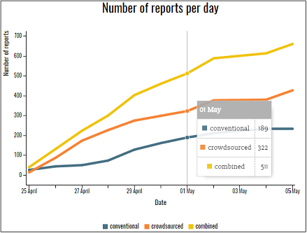

## Comparing Crowdsourced and Conventional Data in the Emergency Response
### A Case Study of the 2015 Nepal Earthquake
#### Kim de Bie, 27 January 2016

#####Overview

Crowdsourced data, such as Twitter messages or Facebook posts, has a large potential to improve the emergency response after natural disasters. Crowdsourced data is said to have a few qualities compared to conventional data. Firstly it is argued to become available from a larger number of locations: **spread** is said to be larger. Researchers also claim that the data is available more **quickly**, and that it contains information about a wider range of **topics**. Nonetheless, aid organizations are reluctant to make use of crowdsourced data: they believe their conventional data collection mechanisms do the job well enough. This website aims to give an overview of both crowdsourced and conventional data as produced during the earthquake in Nepal in 2015. The user of the website can analyze the data in terms of the three qualities (spread in location/speed/spread in topics) that are currently argued as distinguishing for crowdsourced data. On top of this, the website contains general information about disaster data in general and the Nepal earthquake specifically. In this way, I hope to contribute understanding of crowdsourced vs. conventional data. 

#####Spatial spread of the data

The homepage of this website is dedicated to exploring the data as it is produced in different districts during the earthquake. The colors indicate data density: the darker a district, the more data there is available. The buttons allow the user to select either crowdsourced, conventional or both data, so that spread can be compared for the two data types. In addition, a date slider allows the user to view information that became available up to a certain date. 

#####Amount of data over time

The page 'data over time' allows the user to compare how quickly data became available, and thus to analyze the speed-dimension of both data sources. Whereas the homepage gives similar information by displaying the amount of data available at certain points in time at the district level, this page adds information by displaying the total amount of information. Hovering over dates gives the exact number of reports for that date. 

#####Topics of the data

Both the data points on the line graph and the districts on the map are clickable. On clicking, a bar graph appears that allows the user to analyze the last dimension of crowdsourced data that is discussed in the literature: the spread of data  over different topics. 

#####Background information

To place the data visualizations in a context, the website contains two pages that contain general information about a) the Nepal earthquake itself and b) crowdsourced data, and how it compares to conventional disaster data. Moreover, the source of the data is discussed. The pages contain photos to increase visual attractiveness.  

#####External sources

This project builds on various JavaScript libraries, including [D3.js](http://d3js.org/), [C3.js](http://c3js.org/) and [NoUISlider](http://refreshless.com/nouislider/). In addition, this project couldn't have been created without the help of countless tutorials and answered questions on websites such as StackOverflow. The specific authors of tutorials and answers have been attributed throughout the code. 

Photos included are from [Getty Images](http://www.gettyimages.com), [the New York Times](http://www.nytimes.com/), [IRevolution.net](http://irevolutions.org/) and [Kathmandu Living Labs](http://www.kathmandulivinglabs.org/). Moreover, the data used for this project is based on situational reports as published by [UNOCHA](http://www.unocha.org/nepal) and [Humanity Road](http://humanityroad.org/). 

#####Copyright

Copyright (C) 2016 Kim de Bie

This program is free software: you can redistribute it and/or modify it under the terms of the GNU General Public License as published by the Free Software Foundation, either version 3 of the License, or any later version.

This program is distributed in the hope that it will be useful, but WITHOUT ANY WARRANTY; without even the implied warranty of MERCHANTABILITY or FITNESS FOR A PARTICULAR PURPOSE. See the LICENSE file in this folder, or the GNU General Public License for more details: <http://www.gnu.org/licenses/>.